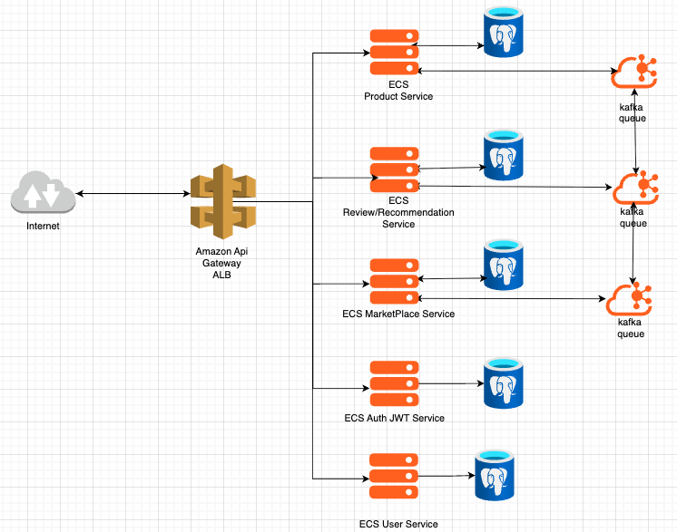

## 🏛️ Structure
### 1. 🎯 Problem Statement and Context

```
Latency Afficionados is a RETRO video game marketplace.
The platform is capable of: 
  - Manage Users
  - Manage the products
  - Provide product search's
  - View products descriptions
  - Rating and review the products 
  - Add comments to a product
  - Provide some recommendation based on previews browsing from the user

The desire:
  - Smallest latencies possible. 
  - Render fast they can.
  - Migrate from Java 1.4 which needs to be migrated to Java 
21.
  - Propose a decomposition of the monolith.
```

### 2. 🎯 Goals
- Update the React 19 (the last stable version)
- Decomposite the monolith using microservice
- Migrate to java 21 (the last LTS)
- ADD coverage tests (Using mockito, unit tests and integration tests and Jacooco/Cobertura)
- ADD stress test (JMeter to simulate multiple access)
- ADD caos tests (Chaos Toolkit to simulate problems)
- Postgresql 17 (the last LTS)


### 3. 🎯 Non-Goals
- Mobile
- Increasing the latency

### 📐 3. Principles
- SSR - Server-Side Rendering (SSR) is when the HTML of a web page is generated on the server and sent fully rendered to the browser, instead of being built dynamically with JavaScript on the client.


### 🏗️ 4. Overall Diagrams
### 🗂️ 4.1 Overall architecture: Show the big picture, relationship between macro components.

### 🗂️ 4.2 Deployment: Show the infra in a big picture. 
### 🗂️ 4.3 Use Cases: Make 1 macro use case diagram that list the main capability that needs to be covered. 


### 🧭 5. Trade-offs
- DataBase
The database choice was considering the kind workload, data access patterns and database modeling.
  - Workload: OLTP (online transactional processing): many short transactional operations, low latency, strong consistency.
  - Data acess pattern: Write-heavy (many inserts/updates) PostgreSQL handles transactional writes well thanks to its strong ACID guarantees and mature indexing.
  - Data Modeling: Relational (row-oriented) Best for normalized data, referential integrity, rich joins, strong transactions.

## PostgreSQL and MySQL Comparison

### Workload 

#### MySQL	- Benefits
- Excellent for simple OLTP (online transactional processing) transactions
- Optimized for read operations
- High throughput with simple operations
- Good connection pooling
- Efficient for simple batch processing

#### MySQL	- Drawbacks
- Limited analytical capabilities
- Performance degrades with complex queries
- Struggles with mixed workloads (OLTP (transactional operations) and OLAP (analytical queries))
- Limited parallel processing
- Less efficient for complex batch operations

#### PostgreSQL	- Benefits
- Superior for complex transactions with ACID (Atomicity, Consistency, Isolation, and Durability) compliance
- Strong analytical capabilities with parallel query execution
- Better workload management and resource controls
- Handles complex operations with high throughput
- Efficient complex batch processing with parallel execution

#### PostgreSQL	- Drawbacks
- Connection management more resource-intensive
- Requires more configuration for optimal performance
- Higher resource utilization
- More complex setup for batch processes
- Steeper learning curve for workload management

### Data Access Patterns 

#### MySQL	- Benefits
- Excellent read performance with replicas and query cache
- Fast point queries on indexed columns
- Efficient sequential reads of simple data
- Simple and straightforward access patterns
- Low overhead for basic read operations

#### MySQL	- Drawbacks
- Limited write scalability
- Table-level locking reduces concurrency in some engines
- Struggles with scattered access patterns
- Poor performance for complex joins
- Contention issues in high-concurrency scenarios
- Limited temporal data capabilities

#### PostgreSQL	- Benefits
- Optimal for complex joins and analytical queries
- Superior write scalability with MVCC
- Better handling of concurrent writes
- Advanced index types for efficient random access
- Excellent optimization for complex joins
- Better hot-spot handling with row-level locking
- Advanced temporal data capabilities

#### PostgreSQL	- Drawbacks
- Requires more tuning for optimal read performance
- Higher memory requirements for connection handling
- More complex configuration for read-heavy workloads
- Index maintenance overhead
- Higher learning curve for utilizing advanced access patterns

While MySQL is excellent for simple, high-throughput OLTP, PostgreSQL is a better general-purpose database that can handle complex queries, mixed workloads, and analytical tasks without degrading transactional performance. This makes it the stronger long-term choice for most modern applications.

### 🌏 6. For each key major component

What is a majore component? A service, a lambda, a important ui, a generalized approach for all uis, a generazid approach for computing a workload, etc...
```
6.1 - Class Diagram              : classic uml diagram with attributes and methods
6.2 - Contract Documentation     : Operations, Inputs and Outputs
6.3 - Persistence Model          : Diagrams, Table structure, partiotioning, main queries.
6.4 - Algorithms/Data Structures : Spesific algos that need to be used, along size with spesific data structures.
```

Exemplos of other components: Batch jobs, Events, 3rd Party Integrations, Streaming, ML Models, ChatBots, etc... 

Recommended Reading: http://diego-pacheco.blogspot.com/2018/05/internal-system-design-forgotten.html

### 🖹 7. Migrations

IF Migrations are required describe the migrations strategy with proper diagrams, text and tradeoffs.

### 🖹 8. Testing strategy

Explain the techniques, principles, types of tests and will be performaned, and spesific details how to mock data, stress test it, spesific chaos goals and assumptions.

### 🖹 9. Observability strategy

Explain the techniques, principles,types of observability that will be used, key metrics, what would be logged and how to design proper dashboards and alerts.

### 🖹 10. Data Store Designs

For each different kind of data store i.e (Postgres, Memcached, Elasticache, S3, Neo4J etc...) describe the schemas, what would be stored there and why, main queries, expectations on performance. Diagrams are welcome but you really need some dictionaries.

### 🖹 11. Technology Stack

Describe your stack, what databases would be used, what servers, what kind of components, mobile/ui approach, general architecture components, frameworks and libs to be used or not be used and why.

### 🖹 12. References

* Architecture Anti-Patterns: https://architecture-antipatterns.tech/
* EIP https://www.enterpriseintegrationpatterns.com/
* SOA Patterns https://patterns.arcitura.com/soa-patterns
* API Patterns https://microservice-api-patterns.org/
* Anti-Patterns https://sourcemaking.com/antipatterns/software-development-antipatterns
* Refactoring Patterns https://sourcemaking.com/refactoring/refactorings
* Database Refactoring Patterns https://databaserefactoring.com/
* Data Modelling Redis https://redis.com/blog/nosql-data-modeling/
* Cloud Patterns https://docs.aws.amazon.com/prescriptive-guidance/latest/cloud-design-patterns/introduction.html
* 12 Factors App https://12factor.net/
* Relational DB Patterns https://www.geeksforgeeks.org/design-patterns-for-relational-databases/
* Rendering Patterns https://www.patterns.dev/vanilla/rendering-patterns/
* REST API Design https://blog.stoplight.io/api-design-patterns-for-rest-web-services


